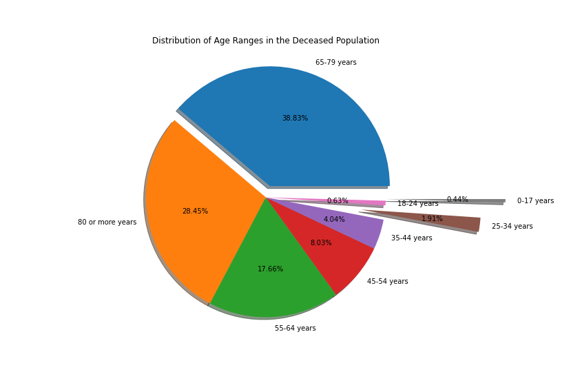
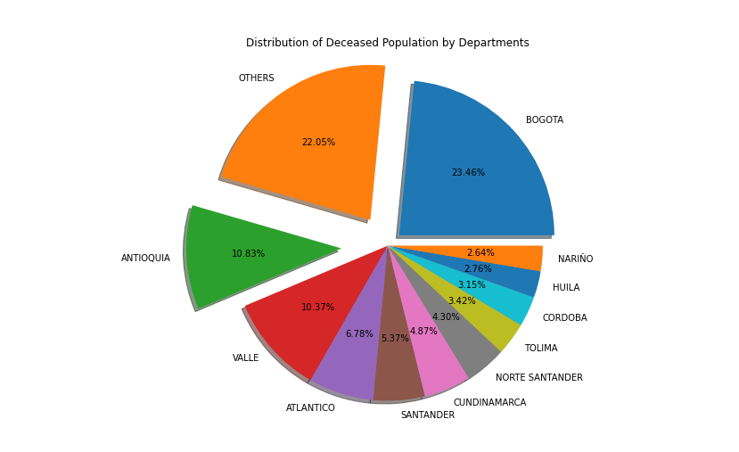

Covid 19 Colombia
================
Table of Content
================
  * [Description](#description)
  * [Files](#files)
  * [Dataset](#dataset)
  * [Results](#results)
  * [Installation guide](#installation-guide)
  * [Credits](#credits)
  * [Licensing](#licensing)
  
## Description
This is a project developed at the [CRI](https://cri-paris.org/en) Université de Paris in the second semester of the Master of Digital Science, within the [Challenge Hub](https://master.cri-paris.org/en/challenge-hub) program.
To carry out the analysis process, the data set for March 7, 2021 was started, in addition to a file of the 2018 census in Colombia and the latitude and longitude coordinates of all the municipalities of Colombia.
The first step was to explore the data set of covid-19 March 7, it is identified that the file has a significant number of rows and columns, so the quality of the data must be verified.

In a second step, the file was updated, moving to March 24 as the starting point, 2021, they include data such as: age, gender, department, municipality, patient's status, date of diagnosis, date of symptoms , recovery date, and other information per patient, there is no name or identification number of the patients.

## Files
For this project, three downloaded files were used in the directions given under, the first one must be downloaded directly from the page described above, in addition, both the page and the file are in Spanish.

  *Covid-19 (7th and 24th)
https://www.ins.gov.co/Noticias/Paginas/Coronavirus.aspx

The other two files can be downloaded from the pages but it works to create a single file with the latitudes and longitudes of each of the country's municipalities, creating the file "Col_Latitude_Longitude.csv"

  *Census 2018 (Colombia)
https://www.dane.gov.co

  *Latitude and Longitude (Municipalities in Colombia)
https://geoportal.dane.gov.co/geovisores/territorio/consulta-divipola-division-politico-administrativa-de-colombia/

## Dataset
* Dataset from March 6,2020 to march 7, 2021.
* Shape (2276656, 23), 
* The file size is very large for the storage capacity of this platform.

* 'fecha reporte web' = Report date Web 
* 'ID de caso' = Case ID 
* 'Fecha de notificación' = Notification date
* 'Código DIVIPOLA departamento'= Department Code 
* 'Nombre departamento' = Department name, Colombia has 32 Departments
* 'Código DIVIPOLA municipio' = Municipality code 
* 'Nombre municipio' = Municipality name, Colombia has 1103 Municipalities
* 'Edad' = age in years
* 'Unidad de medida de edad' = 1 years 
* 'Sexo'= gender, female and male
* 'Tipo de contagio' = Type of contagion
* 'Ubicación del caso'= location of the case 
* 'Estado' = status 
* 'Código ISO del país' = Code of Country
* 'Nombre del país'= Name of Country
* 'Recuperado' = Recovery, it has three possibilities Active, recovery or deceased
* 'Fecha de inicio de síntomas' = symptom onset date
* 'Fecha de muerte'= Death date
* 'Fecha de diagnóstico' = Date of Diagnosis
* 'Fecha de recuperación' = Date of recovery
* 'Tipo de recuperación' = Type of recovery
* 'Pertenencia étnica' = Ethnicity, each ethnicity is identifiied by a number Amerindian = 1, Romani = 2, Raizal = 3, Palanquero = 4, Afrocolombian = 5, white/Mestizo = 6 
* 'Nombre del grupo étnico' = Ethnic group name

the second file has the 2018 census population
Shape (1103, 11)

* 'Code Department' = unique Code of Department
* 'Code Municipality' = unique Code of municipality
* 'Department' = Name of the Department
* 'Municipality' = Name of the municipality
* 'Longitude' = longitude of the municipality
* 'Latitude' = latitude of the municipality
* 'TOTAL' = Total population in the municipality 
* 'Urban Area' = Total population in Urban area
* 'Rural Area' = Total population in rural area

## Results

- The population that constitutes the group of those infected by the covid-sars2 virus is distributed in eight groups, they are represented in a graph where they are differentiated by age groups, the first under 18 years of age, the second from 18 years to the 24 years and later four groups of ten years each one are created until arriving at the one of majors of 80 years. the graph shows that the groups with the most of the infected people are between 25 and 54 years old, these represent three groups of the total population, also, these people are economically active and must be studying or working, the difference in the number of infected people by gender is small, but there are more men identified than women.

!
- The graph shows the same eight age groups as the previous graph, where the age range of population with the most deaths due to the pandemic are the people were over 55 years of age and in all age groups it affects men in a greater number. However, the difference is more notable in the group between 65 and 74 years of age, where deceased men outnumber deceased women by about 400.

- There are five identified ethnic groups, but there is no significant difference that the disease has a difference in the age group of people who are infected.

- There are three different types of status for patients detected with the disease, however it is evident that active people are the youngest and the deceased are mostly the oldest in the population in both genders.

- Colombia is administratively organized into 32 departments and the capital district (Bogotá), the capital has almost a quarter of the deceased, the next three departments have added a little more than another quarter of the deceased. Although the most advanced regions of the country are: Bogotá, Antioquia, Valle del Cauca and Atlantico, also the three regions are those with the largest population in that order. In the particular case of Atlantico, it has Barranquilla, which is the fourth most populated city and has a strong economic presence abroad as it is a port city.

- During the period of the pandemic analyzed, two peaks of cases are identified, the second peak has a greater number of deaths.

- The ten days with the highest number of deaths are located in the second peak of deaths, the exact dates can be identified.

- It is identified that the periods of time to identify a person with the disease and their death was in most cases at least one month before their death, but in many cases it is only one week, in an important group it is postmortem. This graph shows that nearly 15,000 deaths are from post-mortem examinations, which indicates that important work is being done to find cases associated with covid-19.

- This is the result of analyzing the cases of recovered people who underwent a PCR test, but who later died without being recognized at the time of the analysis as deceased by Covid-19. But, at least 100 patients who were recognized as recovered by PCR test died within a month or just few days, These may be due to administrative errors, lack of information on the causes that caused death or not having performed the autopsy in the required time, in any case it is an alert to improve the public report of the causes of death.
- Now, it could be thought that it is a contradiction with the previous graph, it is not the case because in this only the cases of the recovered people and with a PCR test are analyzed..

## Installation guide

If you use conda, you can install: 

   * conda install pandas
   * conda install seaborn
   * conda install numpy

If you use pip, you can install: 

   * pip install pandas
   * pip install seaborn
   * pip install numpy
    
## Credits
The analysis of the dataset was carried out by Eliseo B.
the file is in jupiternotebook format "covid_col_24.pynb"

The information of it is available at:

 *Covid-19 (7th and 24th)
https://www.ins.gov.co/Noticias/Paginas/Coronavirus.aspx

  *Census 2018 (Colombia)
https://www.dane.gov.co

  *Latitude and Longitude (Municipalities in Colombia)
https://geoportal.dane.gov.co/geovisores/territorio/consulta-divipola-division-politico-administrativa-de-colombia/

## Licensing
 Apache License Version 2.0, Eliseo Baquero 2021
