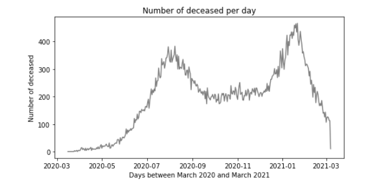

Table of Content
================
* [Covid 19 Colombia](#Covid-19-Col)
  * [Description](#description)
  * [Process](#process)
  * [Files](#files)
  * [Results](#results)
  * [Installation guide](#installation-guide)
  * [Credits](#credits)
  * [Licensing](#licensing)
  
# Covid-19-Col
## Description

To carry out the analysis process, the data set for March 7, 2021 was started, in addition to a file of the 2018 census in Colombia and the latitude and longitude coordinates of all the municipalities of Colombia.
The first step was to explore the data set of covid-19 March 7, it is identified that the file has a significant number of rows and columns, so the quality of the data must be verified.

In a second step, the file was updated, moving to March 24 as the starting point, 2021, they include data such as: age, gender, department, municipality, patient's status, date of diagnosis, date of symptoms , recovery date, and other information per patient, there is no name or identification number of the patients.

## Process

## Files
  *Covid-19 (7th and 24th)
https://www.ins.gov.co/Noticias/Paginas/Coronavirus.aspx

  *Census 2018 (Colombia)
https://www.dane.gov.co

  *Latitude and Longitude (Municipalities in Colombia)
https://geoportal.dane.gov.co/geovisores/territorio/consulta-divipola-division-politico-administrativa-de-colombia/

## Results
* Date: dataset from March 6,2020 to march 7, 2021.
* Dataset from March 6, 2020 to march 24, 2021.
* Shape (2276656, 23), Shape (2347224, 23)

the deceased belong to the group of those over 55 years old, while the most infected are between 25 and 54 years old.

## Installation guide

If you use conda, you can install: 

   * conda install pandas
   * conda install seaborn
   * conda install numpy

If you use pip, you can install: 

   * pip install pandas
   * pip install seaborn
   * pip install numpy
    
## Credits
The analysis of the dataset was carried out by Eliseo B.
the file is in jupiternotebook format "covid_col_24.pynb"

The information of it is available at:

 *Covid-19 (7th and 24th)
https://www.ins.gov.co/Noticias/Paginas/Coronavirus.aspx

  *Census 2018 (Colombia)
https://www.dane.gov.co

  *Latitude and Longitude (Municipalities in Colombia)
https://geoportal.dane.gov.co/geovisores/territorio/consulta-divipola-division-politico-administrativa-de-colombia/

## Licensing
 Apache License Version 2.0, Eliseo Baquero 2021
